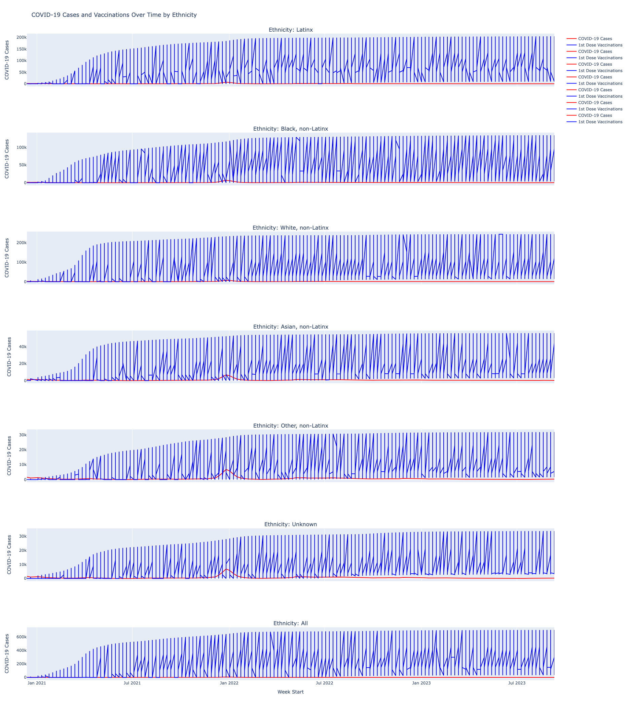
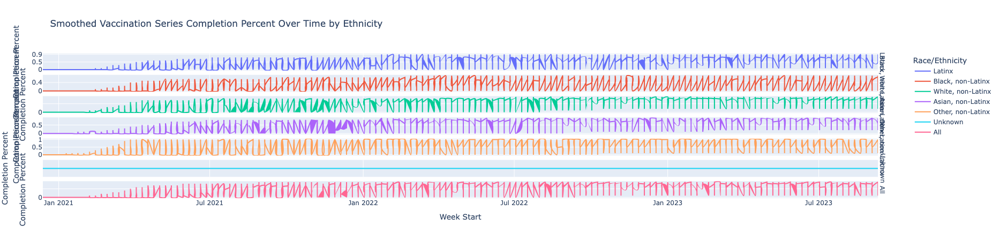
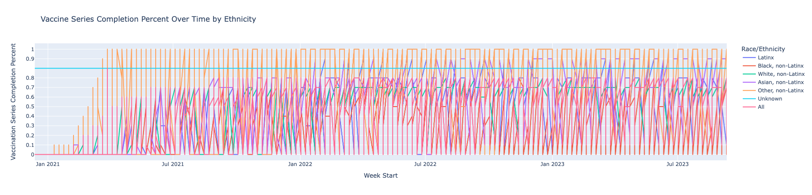

# COVID-19 Data Intelligence Lab

  

> End-to-end epidemiological analytics that blends public health surveillance, vaccination behavior, and obesity trends to surface actionable insights for data-driven policy.

---

## Recruiter Snapshot

| Focus Area | Details |
| --- | --- |
| Problem Statement | Quantify how COVID-19 vaccination uptake varies across race/ethnicity and how it intersects with obesity prevalence. |
| Data Footprint | 7,000+ weekly observations (2019–2023) from CDC respiratory surveillance, vaccination, and BRFSS obesity datasets. |
| Core Skills | Data engineering, feature engineering, statistical EDA, linear modeling, model evaluation, narrative reporting. |
| Key Result | Linear regression cuts MSE by **27.3%** vs. baseline while surfacing demographic gaps in vaccine completion. |

---

## Visual Story


*Vaccination completion trajectories across ethnic groups highlight timing gaps and volatility.*


*Latest-week vaccination share by demographic group surfaces leaders vs. laggards.*


*Juxtaposition of vaccination coverage and obesity sample sizes to highlight structural health disparities.*

---

## Why This Project Stands Out

- **Portfolio-ready narrative** – polished `finalReport.ipynb` and PDF deliverable for stakeholder-friendly consumption.
- **Modular Python package** – reusable `src/main.py` API powering notebooks, scripts, and automated reports.
- **Visual-first storytelling** – curated plots exported to `/visualization` for immediate use in decks or dashboards.
- **Model transparency** – coefficient table + performance chart make the ML section audit-ready for technical reviewers.

---

## Data Sources

1. `Influenza__COVID-19__RSV__and_Other_Respiratory_Virus_Laboratory_Surveillance.(csv/xlsx)` – weekly pathogen testing results.
2. `COVID-19_Vaccinations_by_Age_and_Race-Ethnicity_-_Historical.(csv/xls)` – vaccine uptake metrics by demographic group.
3. `Nutrition__Physical_Activity__and_Obesity_-_Behavioral_Risk_Factor_Surveillance_System (1).csv` – BRFSS obesity prevalence.
4. Derived assets: `data/final_df.csv`, `src/obesity2.csv`, `src/vaccine_Demographics.csv` for fast downstream access.

---

## Project Structure

```
Mamba-Mentality-main/
├─ data/                          # Raw + engineered datasets
├─ src/
│  ├─ main.py                     # Reusable data, EDA, and ML functions
│  ├─ run_report.py               # CLI entry point for fully automated report
│  ├─ finalReport.ipynb           # Polished narrative notebook
│  └─ finalProject.ipynb          # Early exploratory build
├─ visualization/                 # Exported PNGs ready for decks/README
└─ README.md                      # You are here
```

---

## Analytical Pipeline


---

## Key Insights

1. **Vaccination equity gap** – Black, non-Latinx residents consistently trail other groups by double-digit percentage points.
2. **High-performing cohorts** – Asian and Other, non-Latinx populations sustain the fastest completion growth post-2021.
3. **Temporal lift** – Vaccination completion climbs steadily with `days_since_start`, validating campaign momentum.
4. **Obesity linkage** – Communities with higher obesity sample sizes often mirror lower vaccination throughput, flagging compounding risk.

---

## Reproducing the Report Locally

```bash
git clone https://github.com/RamenMachine/covid19-data-analysis.git
cd covid19-data-analysis
python -m venv .venv
.venv\Scripts\activate  # On macOS/Linux use: source .venv/bin/activate
pip install -r requirements.txt
python src/run_report.py
```

The runner script:
- Loads and cleans the CDC + BRFSS datasets.
- Recreates all EDA plots (saved to screen and `visualization/`).
- Trains the linear regression model, prints baseline vs. model MSE, and surfaces coefficients.

---

## Model Performance at a Glance

| Metric | Value |
| --- | --- |
| Baseline MSE (mean predictor) | 0.1241 |
| Linear Regression MSE | 0.0902 |
| Relative Improvement | **27.37%** |
| Top Feature (↑ impact) | `Race/Ethnicity_Other, non-Latinx` |
| Largest Negative Impact | `Race/Ethnicity_Black, non-Latinx` |

`src/main.py` exposes `train_and_evaluate_model`, returning the fitted coefficients, predictions, and evaluation artifacts for downstream experimentation.

---

## Deliverables

- `src/finalReport.ipynb` – narrative walkthrough with commentary, visuals, and recommendations.
- `finalReport-finalDraft.pdf` – client-ready PDF export.
- `visualization/*.png` – hero charts for resumes, decks, and this README.
- `src/run_report.py` – automated artifact generator for recruiters to reproduce results in minutes.

---

## Roadmap

- Extend modeling to gradient boosting for non-linear effects.
- Add socio-economic controls (unemployment, insurance coverage) to contextualize disparities.
- Package core logic into a lightweight Python library for reuse across city-level health studies.

---

## Contact

Questions or collaboration ideas? Open an issue or connect via GitHub: **@RamenMachine**.
